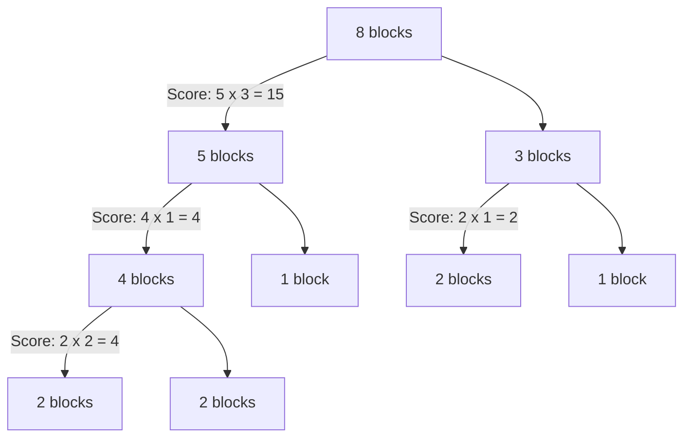

# Lecture 3: Good Proofs, Invariants, and Strong Induction

## Overview
This lecture bridges the gap between writing valid mathematical proofs and applying those concepts to dynamic systems and algorithms. It begins with the qualitative characteristics of good proofs and the historical dangers of logical bugs in both software and mathematics. It then introduces the **Invariant Principle** through a classic state machine problem (the 8-puzzle), demonstrating how to prove that certain states are unreachable. Finally, the lecture formally introduces **Strong Induction**, showcasing its necessity and power by solving the "Unstacking Game" where ordinary induction would fall short.

***

## 1. The Anatomy of a Good Proof & The Danger of Bugs
Writing a rock-solid proof is notoriously difficult; even the world's best mathematicians routinely make errors. It is estimated that one-third of all published mathematical proofs contain flaws. 

### Characteristics of a Good Proof
A mathematical proof should ideally possess seven key characteristics:
1.  **Correct**: The logical deductions must be flawless.
2.  **Complete**: All essential details and key steps must be present.
3.  **Clear**: The reasoning should be easy to follow.
4.  **Brief**: It should avoid crushing the reader with unnecessary minutiae.
5.  **Elegant**: It should be clever and crisp—the mathematician's equivalent of "beautiful" art.
6.  **Well-organized**: Using lemmas (like subroutines in code) helps structure the logic cleanly.
7.  **In Order**: A proof should flow logically from top to bottom. Deriving $a = b$ by starting with $a = b$ and ending with $1 = 1$ is a backwards and confusing practice.

### The Consequences of Logical Bugs
In computer science, writing a rigorous proof is akin to writing bug-free code. Disastrous consequences have arisen from software bugs:
*   **Airbus A300**: The first commercial jet operated entirely by software crashed when a bug accidentally opened the rear door just before landing.
*   **Therac-25**: A race condition in a radiation therapy machine caused it to administer fatal massive overdoses to patients.
*   **2000 US Election**: A software bug in electronic voting booths caused Al Gore to receive negative 16,000 votes in a Florida county.

Even famous mathematicians have fallen victim to logical omissions:
*   **Carl Friedrich Gauss**: In his 1799 PhD thesis proving the fundamental theorem of algebra, Gauss left an "immense gap" claiming a geometric fact was so obvious it needed no proof. It took over 100 years to formally fill that gap.
*   **Pierre de Fermat**: In 1637, Fermat famously claimed in a book margin to have a proof for $x^n + y^n = z^n$ (for $n > 2$), but said the margin was too small to contain it. It took 350 years and hundreds of pages of modern math for Andrew Wiles to actually prove it.

## 2. The "Top 10" Proof Techniques NOT to Use
To avoid these pitfalls, be wary of the following invalid proof techniques frequently seen in computer science and mathematics:
10. **By Throwing in the Kitchen Sink**: Writing down every known theorem hoping the grader will find the right one.
9.  **By Example**: Proving the case for $n=2$ and claiming it holds generally.
8.  **By Vigorous Hand-Waving**: Hoping that gestures and confident speaking replace logic.
7.  **By Cumbersome Notation**: Encrypting the proof in so much dense notation that no one can verify it.
6.  **By Exhaustion**: Making the reader give up out of sheer fatigue.
5.  **By Omission**: Stating "the details are left to the reader" or "the rest is trivial."
4.  **By Picture**: Relying on visual diagrams that can easily hide mathematical falsehoods.
3.  **By Vehement Assertion**: Raising your voice to intimidate questioners.
2.  **By Appeal to Intuition**: Claiming "any moron knows that."
1.  **By Reference to Eminent Authority**: Claiming "I saw Fermat on the elevator and he said he had a proof."

***

## 3. State Machines and The Invariant Principle
To prove that a system can never reach a specific disastrous state (like a nuclear reactor melting down or an airplane crashing), computer scientists use **invariants**. 

### The 8-Puzzle 
Consider a 3x3 sliding puzzle with 8 lettered tiles and one blank square. Legal moves consist of sliding a tile into the adjacent blank square (horizontally or vertically).

**Start State:**
| A | B | C |
|:---:|:---:|:---:|
| **D** | **E** | **F** |
| **H** | **G** | *(blank)* |

**Target State (Alphabetical):**
| A | B | C |
|:---:|:---:|:---:|
| **D** | **E** | **F** |
| **G** | **H** | *(blank)* |

**Theorem:** There is no sequence of legal moves to go from the Start State to the Target State.

**Proof by Invariant:**
We map the 2D grid into a 1D natural order: 1, 2, 3, 4, 5, 6, 7, 8, 9. 
1.  **Row Move**: Moving a tile left or right transitions its position by $\pm 1$. The relative order of the letters remains completely unchanged.
2.  **Column Move**: Moving a tile up or down transitions its position by $\pm 3$. This changes the relative order of the moved tile with exactly the two tiles it jumps over.
3.  **Inversions**: An inverted pair is a pair of letters $(L_1, L_2)$ that are in alphabetical order but appear *out of order* in the puzzle. 
    *   In a row move, the number of inversions stays the same.
    *   In a column move, exactly two pairs reverse order. The number of inversions can increase by 2, decrease by 2, or stay the same (if one pair was inverted and the other was not).
4.  **The Invariant**: During *any* move, the **parity** (evenness or oddness) of the number of inversions does not change.
5.  **Conclusion**: The Start State has exactly 1 inversion (H is before G). Its parity is **odd**. The Target State has 0 inversions. Its parity is **even**. Because parity is strictly preserved by every legal move, reaching the Target State is mathematically impossible.

### The Formal Invariant Principle
If a preserved invariant of a state machine is true for the start state, then it is true for all reachable states. 
*   **Inductive setup for Invariants**: Let $P(n)$ be the proposition that the invariant holds after $n$ moves.
*   **Base Case**: Prove $P(0)$ (the start state).
*   **Inductive Step**: Prove that if the system is in a valid state after $n$ moves, any single transition preserves the property for $n+1$ moves.

***

## 4. Strong Induction
Strong induction is a variant of ordinary induction. Instead of relying solely on the immediately preceding step ($P(n)$) to prove the next step ($P(n+1)$), strong induction allows you to assume that *all* preceding steps are true.

**The Strong Induction Axiom:**
Let $P(n)$ be a predicate. If $P(0)$ is true, and for all natural numbers $n$, the combination of $(P(0) \land P(1) \land \dots \land P(n))$ implies $P(n+1)$, then $P(n)$ is true for all $n \in \mathbb{N}$.

### Example: The Unstacking Game
**Rules:** Start with a stack of $n$ blocks. In each move, divide one stack into two smaller, non-empty stacks. If you divide a stack of size $a+b$ into a stack of size $a$ and a stack of size $b$, your score for that move is $a \times b$. The game ends when you have $n$ stacks of 1 block. Your total score is the sum of the points from every move.

**Theorem:** All strategies for the $n$-block game produce the exact same total score: $S(n) = \frac{n(n-1)}{2}$.

**Proof by Strong Induction:**
1.  **Induction Hypothesis:** $P(n) :=$ The score for unstacking $n$ blocks is $\frac{n(n-1)}{2}$.
2.  **Base Case:** $n=1$. A stack of 1 block requires 0 moves. The formula gives $\frac{1(0)}{2} = 0$. Thus, $P(1)$ is true.
3.  **Inductive Step:** Assume $P(1), P(2), \dots, P(n)$ are all true. We must prove $P(n+1)$.
    *   Consider a stack of $n+1$ blocks. Our first move *must* split this into two stacks of size $k$ and $(n+1-k)$, where $1 \le k \le n$.
    *   The score for this first move is $k(n+1-k)$.
    *   We must now fully unstack the pile of $k$ blocks and the pile of $(n+1-k)$ blocks. 
    *   Because both $k$ and $n+1-k$ are less than or equal to $n$, we can invoke our **strong induction hypothesis** to definitively state their scores: $P(k)$ and $P(n+1-k)$.
    *   Total Score = First Move + Unstacking Left + Unstacking Right
        $= k(n+1-k) + \frac{k(k-1)}{2} + \frac{(n+1-k)(n-k)}{2}$.
    *   Applying algebra (expanding terms and finding a common denominator of 2) causes the $k$ terms to perfectly cancel out, leaving exactly:
        $= \frac{n(n+1)}{2}$.
4.  **Conclusion:** By strong induction, $P(n)$ holds for all $n \ge 1$. The game's score is independent of the strategy chosen.

***

## Practice Problems

**Problem 3.1: The 15-Puzzle**
The 15-puzzle is exactly like the 8-puzzle, but on a 4x4 grid with tiles numbered 1 to 15. The start state has the tiles in numerical order, except 14 and 15 are swapped (15 is placed before 14). Prove that it is impossible to reach the target state (tiles 1 to 15 in perfect numerical order) using the Invariant Principle.
*Hint: Formulate a parity invariant combining the number of inversions and the row index of the empty square.*

**Problem 3.2: Fibonacci Strong Induction**
The Fibonacci sequence is defined as $F(0) = 0$, $F(1) = 1$, and $F(n) = F(n-1) + F(n-2)$ for $n \ge 2$. Prove by strong induction that $F(n)$ is even if and only if $F(n+3)$ is even.

**Problem 3.3: Fast Exponentiation State Machine**
Consider a state machine defined on $\mathbb{R} \times \mathbb{R} \times \mathbb{N}$ starting at $(a, 1, b)$. The transitions are:
If $z$ is even and $>0$: $(x, y, z) \rightarrow (x^2, y, z/2)$
If $z$ is odd and $>0$: $(x, y, z) \rightarrow (x^2, xy, (z-1)/2)$
Prove using the Invariant Principle that the predicate $P(x,y,z) := [y \cdot x^z = a^b]$ is a preserved invariant, and use it to show that if the machine terminates (when $z=0$), $y$ will equal $a^b$.

***

## Further Reading
For a comprehensive review of the formalizations and additional examples of these proofs, refer to **"Mathematics for Computer Science" (mcs.pdf)**:
*   **Chapter 1, Section 1.9:** Good Proofs in Practice (Detailed advice on writing clear, top-down proofs).
*   **Chapter 5, Section 5.2:** Strong Induction (Further examples including Prime Factorization and making change for currency).
*   **Chapter 6, Sections 6.1 - 6.2:** State Machines and The Invariant Principle (Formal definitions of reachability, the Diagonally-Moving Robot, and the Die Hard jug problem).