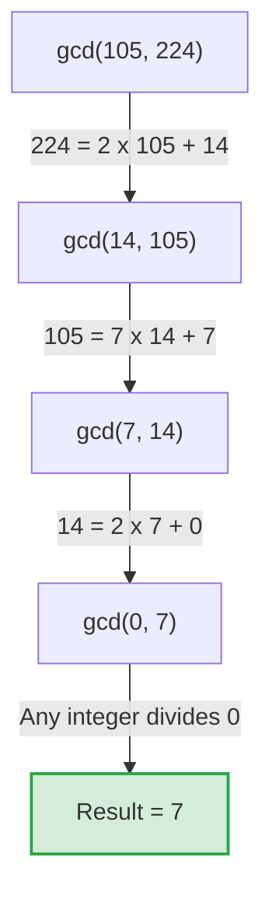

# Lecture 4: Number Theory I – Divisibility, State Machines, and GCD

## Overview
This lecture introduces Number Theory, one of the oldest mathematical disciplines, which focuses on the study of the integers. While historically considered an abstract and "impractical" field, number theory now serves as the foundational mathematics behind modern cryptography and secure digital communications. The lecture explores the concept of **divisibility**, models the classic "Die Hard" water jug problem using **state machines** and the **Invariant Principle**, and formalizes the properties of **Greatest Common Divisors (GCDs)** and **linear combinations**. Finally, it demonstrates **Euclid's Algorithm** for finding the GCD and proves that the GCD of two numbers is their smallest positive linear combination.

***

## 1. Divisibility
The fundamental relation in number theory is divisibility.
*   **Definition:** An integer $m$ divides an integer $a$ (denoted as $m | a$) if and only if there exists an integer $k$ such that $a = k \cdot m$. 
*   This relation is also expressed by saying "$a$ is a multiple of $m$" or "$m$ is a factor of $a$".
*   *Special Case for Zero:* Any integer $m$ divides $0$, because we can choose $k = 0$, satisfying $0 = 0 \cdot m$.

## 2. The *Die Hard* Water Jug Problem
To illustrate number theory in action, we analyze a scenario from the movie *Die Hard 3*, where the heroes must measure exactly 4 gallons of water using only a 3-gallon jug, a 5-gallon jug, and an unlimited water fountain. We can model this rigorously as a state machine.

### State Machine Model
*   **States:** The states are represented by pairs $(x, y)$, where $x$ is the number of gallons in the $a$-gallon jug (the 3-gallon jug) and $y$ is the number of gallons in the $b$-gallon jug (the 5-gallon jug). We assume $a \le b$.
*   **Start State:** Both jugs are initially empty, so the start state is $(0, 0)$.
*   **Transitions:** There are three types of legal moves:
    1.  **Emptying:** $(x, y) \rightarrow (0, y)$ or $(x, y) \rightarrow (x, 0)$.
    2.  **Filling:** $(x, y) \rightarrow (a, y)$ or $(x, y) \rightarrow (x, b)$.
    3.  **Pouring:** We can pour from one jug to another until either the source jug is empty or the destination jug is full. 
        *   Pouring $a$ into $b$: If $x + y \le b$, the new state is $(0, x+y)$. If $x + y \ge b$, the new state is $(x+y-b, b)$.
        *   Pouring $b$ into $a$: If $x + y \le a$, the new state is $(x+y, 0)$. If $x + y \ge a$, the new state is $(a, y - (a-x))$.

### The Divisibility Invariant
What amounts of water can we possibly measure? 
**Theorem:** If $m | a$ and $m | b$, then $m$ divides any result that can be achieved in the state machine.
*   **Proof by Invariant:** Let our invariant $P(n)$ be: "If $(x,y)$ is the state after $n$ transitions, then $m|x$ and $m|y$".
*   **Base Case:** $P(0)$ is the state $(0,0)$. Since $m|0$, $P(0)$ is true.
*   **Inductive Step:** Assume $P(n)$ is true for state $(x,y)$, meaning $m|x$ and $m|y$. After another transition, the new values in the jugs will be drawn from the set $\{0, a, b, x, y, x+y, x+y-a, x+y-b\}$. Because $m$ divides $a$, $b$, $x$, and $y$, basic divisibility rules dictate that $m$ also divides any linear combination of these values (like $x+y$ or $x+y-b$). Thus, the invariant is preserved.

*   **Die Hard 5 Consequence:** If the movie featured a 33-gallon jug and a 55-gallon jug, could they measure exactly 4 gallons? No. Both 33 and 55 are divisible by 11, so any reachable amount must be a multiple of 11. Since 11 does not divide 4, achieving 4 gallons is mathematically impossible.

## 3. Greatest Common Divisor (GCD) and Linear Combinations
*   **Definition:** The Greatest Common Divisor of $a$ and $b$, denoted $\gcd(a, b)$, is the largest integer that divides both $a$ and $b$. 
*   **Relatively Prime:** Two numbers $a$ and $b$ are *relatively prime* if $\gcd(a, b) = 1$. For example, $\gcd(3, 5) = 1$.
*   **Corollary:** The $\gcd(a,b)$ divides any result that can be generated by the water jugs state machine.

### Reaching Any Linear Combination
**Theorem:** Any linear combination $L = s \cdot a + t \cdot b$ (where $0 \le L \le b$) can be reached by the water jug state machine.
*   To prove this constructively, we can force the coefficient $s$ to be a positive integer $s'$ by adding and subtracting a multiple of $a \cdot b$ (i.e., $L = (s+nb)a + (t-na)b$).
*   **The Algorithm:** To obtain $L$ gallons, repeat the following sequence $s'$ times:
    1. Fill the $a$-jug.
    2. Pour it into the $b$-jug.
    3. Whenever the $b$-jug becomes full, empty it out, and continue pouring the $a$-jug into the $b$-jug.
*   *Example to get 4 gallons with 3 and 5:* $4 = 3 \cdot 3 - 1 \cdot 5$. Here $s'=3$. We fill the 3-jug and pour into the 5-jug exactly 3 times, emptying the 5-jug whenever it fills up, ultimately leaving exactly 4 gallons.

## 4. Euclid's Algorithm
To characterize the GCD further, we use Euclid's Algorithm (also known as the Pulverizer when keeping track of coefficients), based on the Division Theorem.
*   **The Division Theorem:** For $d \neq 0$, there exist unique integers $q$ (quotient) and $r$ (remainder) such that $b = q \cdot a + r$, where $0 \le r < a$.
*   **Lemma:** $\gcd(a, b) = \gcd(\text{rem}(b, a), a)$.

*Visualizing Euclid's Algorithm to compute the GCD of 105 and 224.*

**Proof of the Lemma:**
If $m$ divides $a$ and $m$ divides $b$, then $m$ also divides $b - q \cdot a$, which is the remainder $r$. Conversely, if $m$ divides the remainder $r$ and $m$ divides $a$, it must also divide $r + q \cdot a = b$. Thus, the common divisors of $(a,b)$ are exactly the same as the common divisors of $(\text{rem}(b,a), a)$, meaning their greatest common divisors must be identical.

## 5. The Ultimate Characterization of the GCD
By running Euclid's algorithm to its conclusion, the operations can be back-substituted to express the GCD itself as a linear combination of $a$ and $b$.
**Theorem:** $\gcd(a,b)$ is a linear combination of $a$ and $b$.
Combining this with our earlier findings yields a profound structural truth about the integers:
**Final Theorem:** $\gcd(a, b)$ is the **smallest positive linear combination** of $a$ and $b$. 
*   *Reasoning:* We know $\gcd(a,b)$ divides every linear combination of $a$ and $b$. We also know $\gcd(a,b)$ *is* a linear combination. Because the GCD divides all reachable positive values, it must be less than or equal to all of them, making it the absolute smallest positive linear combination possible.

***

## Practice Problems

**Problem 4.1: The Pulverizer**
(a) Use the Pulverizer (Extended Euclidean Algorithm) to find integers $x, y$ such that $x \cdot 30 + y \cdot 22 = \gcd(30, 22)$.
(b) Now find integers $x_0, y_0$ with $0 \le y_0 < 30$ such that $x_0 \cdot 30 + y_0 \cdot 22 = \gcd(30, 22)$.

**Problem 4.2: Extending Die Hard to Three Jugs**
Suppose the jug filling scenario is extended to three jugs that can hold $a, b$, and $c$ gallons of water, respectively, plus a receptacle that can store an unlimited amount of water but has no measurement markings.
(a) Model this scenario with a state machine. What are the states? How does a state change in response to a move?
(b) Prove that Bruce can get $k \in \mathbb{N}$ gallons of water into the receptacle using the legal operations if $\gcd(a,b,c) | k$.

**Problem 4.3: Fast Euclidean Algorithm**
Let $x := 21212121$ and $y := 12121212$.
Use the Euclidean algorithm to find the GCD of $x$ and $y$. *(Hint: Looks scary, but it’s not.)*

***

## Further Reading
For a deeper dive into Number Theory and the formalisms of State Machines, please refer to **"Mathematics for Computer Science" (mcs.pdf)**:
*   **Chapter 6, Section 6.2.3:** The Die Hard Example (Formal state machine transitions and the permanent demise of Bruce using the 9-gallon jug).
*   **Chapter 9, Section 9.1:** Divisibility and Facts about Divisibility (Includes the formal statement of the Division Theorem).
*   **Chapter 9, Section 9.2:** The Greatest Common Divisor (Detailed walk-through of Euclid's Algorithm, The Pulverizer, and solving the universal water jug problem).