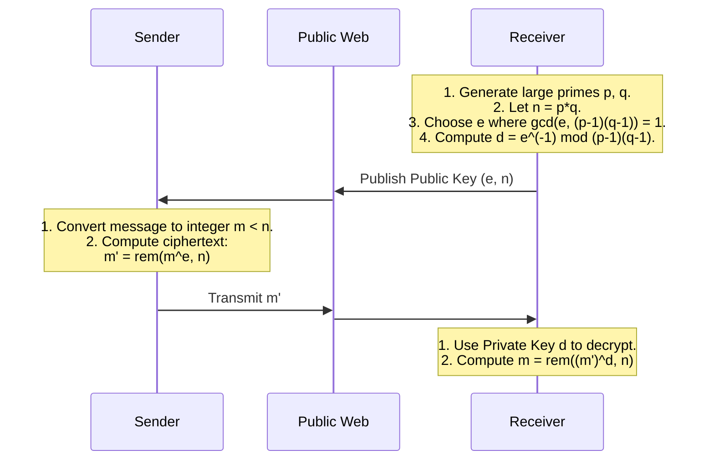

# Lecture 5: Number Theory II – Cryptography and RSA

## Overview
This lecture transitions the foundational concepts of Number Theory into one of its most critical modern applications: **Cryptography**. We follow the historical evolution of cryptography through the lens of Alan Turing's hypothetical codes, exposing the vulnerabilities of basic multiplicative and modular ciphers. This motivates the need for a robust system, leading to the introduction of **Euler's Totient Function**, **Euler's Theorem**, and **Fermat's Little Theorem**. Finally, the lecture culminates in the **RSA Public Key Cryptosystem**, explaining both its mathematical mechanics (how encryption and decryption work) and its security (which relies on the computational difficulty of factoring large primes).

***

## 1. Turing's Code Version 1.0
Alan Turing proposed using number theory for cryptography to secure communications during World War II. Let us conceptualize a basic encryption scheme he might have considered.

**Setup:**
1.  Translate a text message into an integer $m$. For example, map $A \to 01$, $B \to 02$, etc..
2.  Pad the message with a few digits so that the resulting number $m$ is a **prime number**.
3.  The sender and receiver agree on a secret key, which is also a large prime $k$.

**Encryption:** 
The sender encrypts the message $m$ to produce the ciphertext $m'$ by multiplying it by the key:
$$m' = m \cdot k$$

**Decryption:** 
The receiver decrypts $m'$ by dividing by the key:
$$m = \frac{m'}{k}$$

### The Flaw in Version 1.0
This cipher is highly vulnerable. Suppose the adversary (the Nazis) intercepts two separate encrypted messages sent using the same key: $m'_1 = m_1 \cdot k$ and $m'_2 = m_2 \cdot k$. 
Because $m_1$, $m_2$, and $k$ are all prime numbers, the greatest common divisor (GCD) of $m'_1$ and $m'_2$ is exactly $k$. By using Euclid's Algorithm (from Lecture 4), the adversary can easily compute $\gcd(m'_1, m'_2) = k$, instantly recovering the secret key and breaking the entire system.

## 2. Modular Arithmetic and Multiplicative Inverses
To build a better code, we need the mechanics of modular arithmetic.

**Definition (Congruence):** $x$ is congruent to $y$ modulo $n$, denoted $x \equiv y \pmod n$, if and only if $n$ divides the difference $(x - y)$.
*   *Equivalently:* $x \equiv y \pmod n \iff \text{rem}(x, n) = \text{rem}(y, n)$.

**Definition (Multiplicative Inverse):** The multiplicative inverse of $x$ modulo $n$ is a number $x^{-1}$ in the range $[0, n-1]$ such that:
$$x \cdot x^{-1} \equiv 1 \pmod n$$

**Condition for Existence:** An integer $k$ has a multiplicative inverse in $\mathbb{Z}_n$ if and only if $k$ and $n$ are **relatively prime** (i.e., $\gcd(k, n) = 1$).
*   *Example:* 2 is the inverse of 3 modulo 5 because $2 \cdot 3 = 6 \equiv 1 \pmod 5$.
*   *Example:* 3 has no inverse modulo 15 because $\gcd(3, 15) = 3 \neq 1$. If $3 \cdot j \equiv 1 \pmod{15}$, multiplying by 5 gives $15 \cdot j \equiv 5 \pmod{15} \implies 0 \equiv 5 \pmod{15}$, a contradiction.

## 3. Turing's Code Version 2.0
To fix the GCD flaw, we use modular arithmetic. 

**Setup:** 
The sender and receiver publicly agree on a large prime $p$. They secretly agree on a prime key $k < p$. The message $m$ is an integer in $[0, p-1]$.

**Encryption:**
$$m' = \text{rem}(m \cdot k, p) \implies m' \equiv m \cdot k \pmod p$$

**Decryption:**
Because $p$ is prime, $\gcd(k, p) = 1$, meaning $k$ has a multiplicative inverse $k^{-1} \pmod p$. The receiver multiplies the ciphertext by $k^{-1}$:
$$m' \cdot k^{-1} \equiv m \cdot k \cdot k^{-1} \equiv m \cdot 1 \equiv m \pmod p$$

### The Flaw in Version 2.0 (Known-Plaintext Attack)
Suppose the adversary obtains a single matching pair of a plaintext message $m$ and its ciphertext $m'$. 
Since $m$ is known and $p$ is public, the adversary can compute $m^{-1} \pmod p$ using the Extended Euclidean Algorithm (the Pulverizer). 
Then, they can solve for the secret key $k$:
$$m' \cdot m^{-1} \equiv m \cdot k \cdot m^{-1} \equiv k \pmod p$$
Once $k$ is exposed, all past and future messages are compromised.

## 4. Euler's Totient Function and Euler's Theorem
To achieve true security, we require a system where knowing the public encryption parameters does not easily yield the decryption parameters. This relies on Euler's Totient Function.

**Definition:** Euler's Totient Function, $\phi(n)$, is the number of integers in $[1, n-1]$ that are relatively prime to $n$.
*   *Prime numbers:* If $p$ is prime, every integer from $1$ to $p-1$ is relatively prime to $p$, so $\phi(p) = p - 1$.
*   *Product of two primes:* If $n = p \cdot q$ (where $p, q$ are distinct primes), then $\phi(pq) = (p-1)(q-1)$.

**Euler's Theorem:** If $\gcd(k, n) = 1$, then:
$$k^{\phi(n)} \equiv 1 \pmod n$$

**Fermat's Little Theorem:** As a special case of Euler's Theorem, if $p$ is prime and $p$ does not divide $k$:
$$k^{p-1} \equiv 1 \pmod p$$

## 5. The RSA Public Key Cryptosystem
Invented by Rivest, Shamir, and Adleman at MIT in 1977, RSA is a public-key cryptosystem. A receiver publishes a key that anyone can use to encrypt a message, but only the receiver possesses the private key required to decrypt it.

### RSA Protocol Mechanics
1. **Key Generation (Receiver):**
    *   Generate two distinct large primes, $p$ and $q$.
    *   Compute $n = p \cdot q$.
    *   Compute $\phi(n) = (p-1)(q-1)$.
    *   Select a public exponent $e$ such that $\gcd(e, \phi(n)) = 1$.
    *   Use the Pulverizer to find the private exponent $d$, which is the multiplicative inverse of $e$ modulo $\phi(n)$. Thus, $d \cdot e \equiv 1 \pmod{\phi(n)}$.
    *   **Public Key:** $(e, n)$. **Private Key:** $(d, n)$.

2. **Encryption (Sender):**
    *   The sender obtains $(e, n)$ and computes the ciphertext $m'$:
    $$m' = \text{rem}(m^e, n)$$

3. **Decryption (Receiver):**
    *   The receiver uses their private key $d$ to compute:
    $$m = \text{rem}((m')^d, n)$$

**Why Decryption Works:**
Since $d \cdot e \equiv 1 \pmod{\phi(n)}$, there exists an integer $r$ such that $d \cdot e = 1 + r\phi(n)$.
When the receiver computes $(m')^d \pmod n$:
$$(m')^d \equiv (m^e)^d \equiv m^{e \cdot d} \equiv m^{1 + r\phi(n)} \equiv m \cdot (m^{\phi(n)})^r \pmod n$$
By Euler's Theorem, if $\gcd(m, n) = 1$, then $m^{\phi(n)} \equiv 1 \pmod n$.
$$m \cdot (1)^r \equiv m \pmod n$$
*(Note: Even if $\gcd(m, n) \neq 1$, Chinese Remainder Theorem guarantees the math still cleanly yields $m \pmod n$)*.

**Security of RSA:**
The security relies on the assumption that **factoring large integers is computationally infeasible**. An attacker sees the public key $(e, n)$. To find the private key $d$, they must know $\phi(n) = (p-1)(q-1)$. Finding $\phi(n)$ requires knowing $p$ and $q$, which means the attacker must be able to factor $n$. If $n$ is the product of two 300-digit primes, factoring it is beyond the limits of current computational power.

***

## Practice Problems

**Problem 5.1: Multiplicative Inverses & Euler's Function**
(a) Prove that $22^{12001}$ has a multiplicative inverse modulo 175.
(b) What is the value of $\phi(175)$, where $\phi$ is Euler's function?
(c) What is the remainder of $22^{12001}$ divided by 175?
*(Reference: mcs.pdf, Problem 9.52)*

**Problem 5.2: Properties of Euler's Function**
Let $\phi$ be Euler's function.
(a) What is the value of $\phi(2)$?
(b) What are three nonnegative integers $k > 1$ such that $\phi(k) = 2$?
(c) Prove that $\phi(k)$ is even for $k > 2$. *(Hint: Consider whether $k$ has an odd prime factor or not.)*
*(Reference: mcs.pdf, Problem 9.60)*

**Problem 5.3: Hacking RSA**
Suppose a cracker knew how to factor the RSA modulus $n$ into the product of distinct primes $p$ and $q$. Explain how the cracker could use the public key-pair $(e, n)$ to find a private key-pair $(d, n)$ that would allow him to read any message encrypted with the public key.
*(Reference: mcs.pdf, Problem 9.80)*

***

## Further Reading
For a deeper dive into the formalisms of the topics covered in this lecture, please refer to **"Mathematics for Computer Science" (mcs.pdf)**:
*   **Chapter 9, Section 9.5:** Alan Turing (Historical context of Turing's codes, Version 1.0, and breaking the code).
*   **Chapter 9, Section 9.6 - 9.7:** Modular Arithmetic and Remainder Arithmetic.
*   **Chapter 9, Section 9.8 - 9.9:** Turing's Code (Version 2.0) and Multiplicative Inverses.
*   **Chapter 9, Section 9.10:** Euler's Theorem (Detailed proofs of Euler's Totient Function, Euler's Theorem, and Fermat's Little Theorem).
*   **Chapter 9, Section 9.11:** RSA Public Key Encryption (Formal breakdown of the RSA protocol and its proofs of correctness).