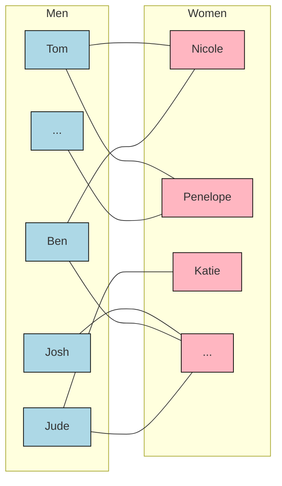
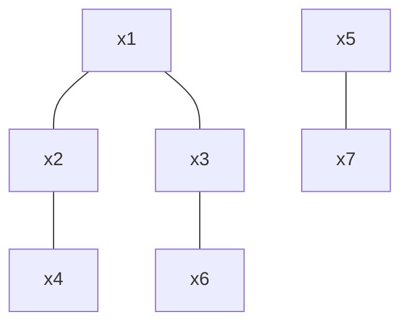
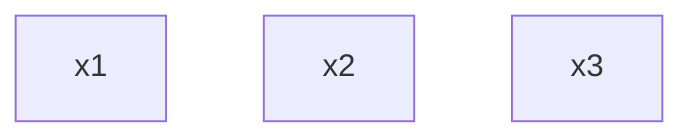
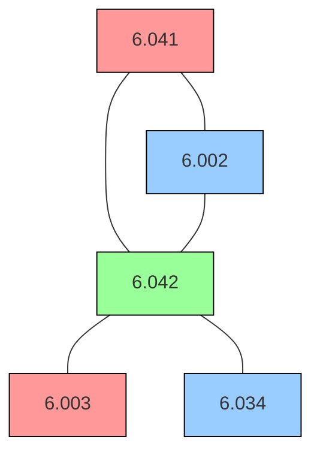
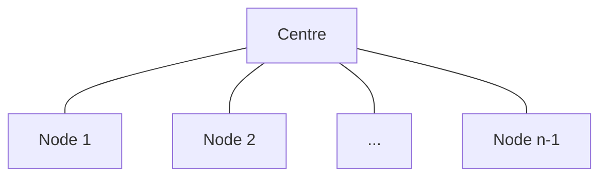
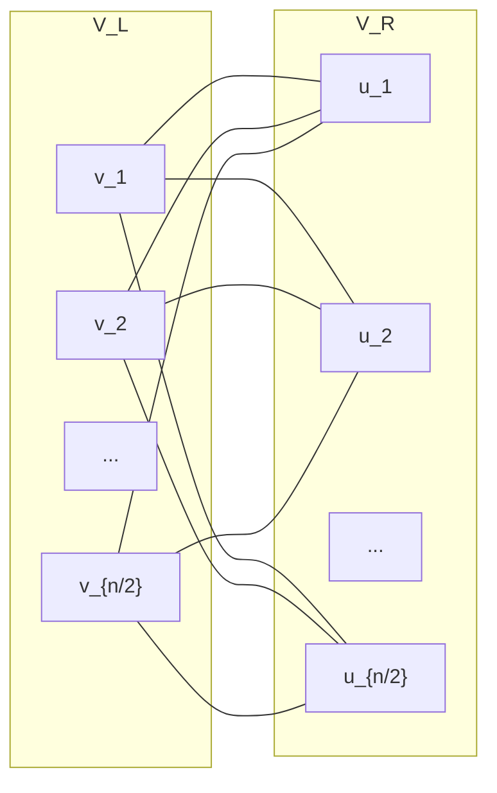
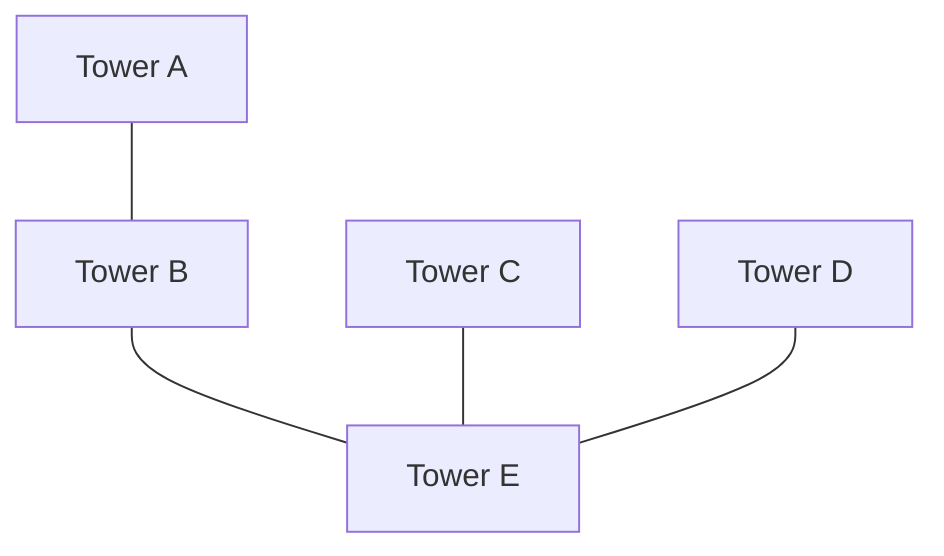

# Lecture 6: Graph Theory and Graph Colouring

## Overview
This lecture introduces **Graph Theory**, a fundamental structure in computer science used to model pairwise relationships ranging from scheduling conflicts to communication networks. It begins by debunking widely cited sociological studies on the disparity of opposite-gender partners between men and women using a bipartite graph property. The lecture formally defines **simple graphs**, **vertices**, **edges**, and **degrees**. It then explores **graph colouring**, specifically motivated by the problem of scheduling final exams without time-slot conflicts. We examine the **chromatic number**, the **basic (greedy) graph colouring algorithm**, and rigorously prove that any graph with maximum degree $d$ can be coloured with at most $d+1$ colours. The lecture concludes by discussing **bipartite graphs**, including "nasty" edge cases, and real-world applications of graph colouring.

***

## 1. Graph Theory and Sexual Demographics
To illustrate the power of graphs, the lecture tackles a long-standing sociological debate: *On average, who has more opposite-gender partners, men or women?*
Various highly publicised studies have claimed massive disparities: a University of Chicago study claimed men have 74% more partners, and an ABC News poll claimed an astounding 233% disparity. 

We can evaluate these claims mathematically by modelling the population as a **bipartite graph**. 
*   **Nodes (Vertices):** People in the USA. We split them into two sets: $V_m$ (Men) and $V_w$ (Women).
*   **Edges:** A line connects a man and a woman if they have been partners. 

As drawn in the notes, this is an enormous graph with $n$ people, represented below with "$\dots$" to indicate the millions of nodes and edges connecting the populations.

Let $A_m$ be the average number of partners for men, and $A_w$ be the average for women. 
To find the average degree for men, we sum all the degrees of the men and divide by the total number of men ($|V_m|$). 
Because every edge connects exactly one man and one woman, the sum of the degrees of all men is exactly equal to the total number of edges in the graph ($|E|$). The same logic applies to women.
$$A_m = \frac{|E|}{|V_m|} \quad \text{and} \quad A_w = \frac{|E|}{|V_w|}$$

If we look at the ratio between the two averages:
$$\frac{A_m}{A_w} = \frac{|E| / |V_m|}{|E| / |V_w|} = \frac{|V_w|}{|V_m|}$$

**Conclusion:** The ratio of average partners is strictly determined by the ratio of women to men in the population. Using US Census data, there are about 152.4 million women and 147.6 million men. 
$$\frac{152.4}{147.6} \approx 1.0325$$
Men have, on average, exactly **3.25% more** opposite-gender partners than women simply because there are fewer men. The published studies claiming 74% or 233% disparities are mathematically impossible.

## 2. Formal Definitions of Graphs
*   **Simple Graph:** A simple graph $G$ is a pair of sets $(V, E)$, where $V$ is a non-empty set of items called **vertices** (or nodes), and $E$ is a set of 2-item subsets of $V$ called **edges**. 
*   **Example from notes:** $V = \{x_1, x_2, \dots, x_7\}$ and $E = \{ \{x_1, x_2\}, \{x_1, x_3\}, \dots, \{x_5, x_7\} \}$.

*   **Empty Graph:** A graph must have at least one node, but it is not required to have any edges. For example, a 3-node empty graph:

*   *Note:* Simple graphs do not allow *loops* (an edge connecting a node to itself) or *multiple edges* (two identical edges connecting the same pair of nodes).
*   **Adjacency:** Two nodes $x_i$ and $x_j$ are adjacent if $\{x_i, x_j\}$ is an edge in $E$.
*   **Incidence:** An edge $e = \{x_i, x_j\}$ is said to be *incident* to its endpoints $x_i$ and $x_j$.
*   **Degree:** The degree of a node is the number of edges incident to it.

## 3. Graph Colouring and Scheduling
Graphs are extremely useful for modelling conflicts, where an edge denotes that two nodes *cannot* be grouped together. 

### The Exam Scheduling Problem
Consider scheduling final exams. If two classes have overlapping student enrollment, their exams cannot be scheduled at the same time. We can model this by assigning a node to each class and drawing an edge between classes that share students. 

Furthermore, we are given specific **time slots** for the exams. We assign each time slot a colour:

| Colour | Time Slot |
| :--- | :--- |
| $C_1$ | Wednesday 5:00 PM - 7:00 PM |
| $C_2$ | Wednesday 7:00 PM - 9:00 PM |
| $C_3$ | Wednesday 9:00 PM - 11:00 PM |
| $C_4$ | Wednesday 11:00 PM - 1:00 AM |
| $C_5$ | Wednesday 1:00 AM - 3:00 AM |

*Visualising an exam conflict graph. 6.041, 6.002, and 6.042 form a triangle, meaning they all conflict with each other. By assigning $C_1$ (Wed 5-7 PM) to 6.041 and 6.003, $C_2$ (Wed 7-9 PM) to 6.002 and 6.034, and $C_3$ (Wed 9-11 PM) to 6.042, we avoid forcing students to take exams at 1:00 AM ($C_4$ or $C_5$).*

**Graph Colouring Problem:** Given a graph $G$ and $k$ colours, assign a colour to each node so that adjacent nodes get different colours.
**Chromatic Number ($\chi(G)$):** The minimum number of colours required to legally colour a graph $G$. For the graph above, $\chi(G) = 3$ because of the triangle formed by 6.041, 6.002, and 6.042. 

### The Basic (Greedy) Graph Colouring Algorithm
Determining the chromatic number for an arbitrary graph is an **NP-complete** problem. Because we must schedule exams in practice, we use a "greedy algorithm" that goes one step at a time, making the best choice at each step without going back.
1.  Order the nodes $v_1, v_2, \dots, v_n$.
2.  Order the colours $C_1, C_2, \dots$.
3.  Process the nodes one at a time. Assign each node the **lowest legal colour** (a colour not already assigned to any of its adjacent neighbours).

The number of colours this algorithm uses heavily depends on the initial ordering of the nodes. 

## 4. Bounding the Colours: A Theorem and Proof
Even in the worst-case node ordering, we can mathematically bound the number of colours the basic algorithm will use based on the graph's maximum degree.

**Theorem:** If every node in an $n$-node graph $G$ has degree $\le d$, then the basic algorithm uses at most $d + 1$ colours for $G$.

**Proof by Induction:** 
*Warning:* A massive pitfall in graph induction is trying to induct on the maximum degree $d$. This requires removing all nodes of degree $d+1$, which destroys the graph structure. When doing induction on graphs, **almost always induct on $n$, the number of nodes**.

1.  **Induction Hypothesis:** $P(n) :=$ If every node in an $n$-node graph has degree $\le d$, then the basic algorithm uses at most $d + 1$ colours.
2.  **Base Case ($n=1$):** A 1-node graph has 0 edges, so max degree $d=0$. It requires 1 colour. Since $1 \le 0 + 1$, $P(1)$ holds.
3.  **Inductive Step:** Assume $P(n)$ is true. Let $G$ be any $(n+1)$-node graph with max degree $\le d$. 
    *   Consider the node ordering $v_1, v_2, \dots, v_{n+1}$.
    *   Remove the last node, $v_{n+1}$, and its incident edges to create an $n$-node subgraph $G'$. 
    *   Removing a node cannot increase the degree of any remaining nodes, so $G'$ still has max degree $\le d$.
    *   By our induction hypothesis $P(n)$, the basic algorithm colours $G'$ using at most $d+1$ colours.
    *   Now, we place $v_{n+1}$ back into the graph to colour it. It has at most $d$ neighbours (let's call them $u_1, u_2, \dots, u_d$). 
    *   Because it has $\le d$ neighbours, those neighbours can invalidate at most $d$ colours. Since we have a pool of $d+1$ colours, there must be **at least one legal colour remaining** in the set $\{C_1, C_2, \dots, C_{d+1}\}$ to assign to $v_{n+1}$. 
    *   Therefore, the entire $(n+1)$-node graph is coloured using $\le d+1$ colours, proving $P(n) \implies P(n+1)$. $\blacksquare$

*Note:* This theorem provides an upper bound; it does not mean $d+1$ colours are always required. 

### The Star Graph Exception
Consider a **Star Graph** with $n$ nodes: 1 centre node connected to $n-1$ outer nodes. 
*   The maximum degree $d = n-1$.
*   The theorem bounds the colours at $d+1 = n$ colours. 
*   However, the actual chromatic number $\chi(G) = 2$ (one colour for the centre, another for all the arms). 
*   The theorem is true, but the bound of $d+1$ is "way off" for this specific topology.

## 5. Bipartite Graphs
**Definition:** A graph $G=(V, E)$ is bipartite if the vertices can be partitioned into two sets, $V_L$ and $V_R$, such that every edge connects a node in $V_L$ to a node in $V_R$. 

The chromatic number of any bipartite graph with at least one edge is always exactly 2. 

### Complete Bipartite Graph
A complete bipartite graph has all possible edges between $V_L$ and $V_R$. If there are $n/2$ nodes on each side, the maximum degree $d = n/2$. Despite $d$ being very large, $\chi(G) = 2$, and the basic greedy algorithm handles it perfectly, returning 2 colours regardless of the node ordering.

### The "Nasty" Bipartite Graph
Consider a graph that is almost a complete bipartite graph, except it is missing exactly the straight-across edges ($v_1$ to $u_1$, $v_2$ to $u_2$, etc.).

This graph is extremely sensitive to the basic algorithm's node ordering:

*   **Good Ordering:** If you order down the left side first ($v_1 \dots v_{n/2}$), then the right side, the algorithm uses **2 colours**.
*   **Bad Ordering:** If you jump back and forth across the gap ($v_1, u_1, v_2, u_2 \dots$), $v_1$ and $u_1$ get $C_1$. When you process $v_2$, it is connected to $u_1$, so it must get $C_2$. $u_2$ is connected to $v_1$, so it also gets $C_2$. Continuing this pattern, the algorithm will use a new colour for every pair, ultimately forcing **$n/2$ colours** for a graph that theoretically only needs 2. 

## 6. Real-World Applications of Graph Colouring
Beyond exams, graph colouring solves many resource-allocation problems:
*   **Software Deployment:** Akamai distributes updates to 75,000 servers. Edges are placed between servers running critical paired functions that cannot go down simultaneously. The graph is coloured in 8 colours, allowing the network to be safely updated in 8 "waves".
*   **Register Allocation:** Compilers assign variables to a limited number of CPU registers. Variables active at the same time are connected by an edge. Colouring the graph maps variables to registers safely.
*   **Radio Frequencies:** Cell towers with overlapping coverage areas are connected by edges. 

*   In the example above, to minimise expensive frequency bands, overlapping towers must be assigned different colours (frequencies). This specific graph can be resolved using just 3 frequencies.

***

## Practice Problems

**Problem 6.1: The Handshaking Lemma**
Prove that in every simple graph, the sum of the degrees of the vertices equals twice the number of edges. Then, conclude that at a party where some people shake hands, the number of people who shake an odd number of hands must be even.
*(Reference: mcs.pdf, Problem 12.3)*

**Problem 6.2: Evaluating Demographics Data**
A researcher analysing data on heterosexual sexual behaviour in a group of $m$ males and $f$ females found that within the group, the male average number of female partners was 10% larger than the female average number of male partners. 
(a) For what constant $c$ is $m = c \cdot f$?
(b) The data shows that approximately 20% of the females were virgins, while only 5% of the males were. The researcher wonders how excluding virgins from the population would change the averages. What is the new ratio of non-virgin male average partners to non-virgin female average partners?
*(Reference: mcs.pdf, Problem 12.4)*

**Problem 6.3: Maximum Chromatic Bound**
A basic example of a simple graph with chromatic number $n$ is the complete graph on $n$ vertices ($K_n$). This implies any graph with $K_n$ as a subgraph must have chromatic number at least $n$. However, graphs with high chromatic numbers do *not* necessarily contain complete subgraphs. Describe or draw a simple graph that requires 4 colours but contains no triangles (no $K_3$ subgraphs). 
*(Reference: mcs.pdf, Problem 12.30)*

***

## Further Reading
For deeper study into the topics covered in this lecture, please refer to **"Mathematics for Computer Science" (mcs.pdf)**:
*   **Chapter 12, Section 12.1:** Vertex Adjacency and Degrees (Formal definitions of graphs, vertices, and edges).
*   **Chapter 12, Section 12.2:** Sexual Demographics in America (The mathematical breakdown of the partner disparity paradox and the Handshaking Lemma).
*   **Chapter 12, Section 12.6:** Colouring (Detailed bounds on graph colourability, including the greedy algorithm proof and the Akamai scheduling applications).
