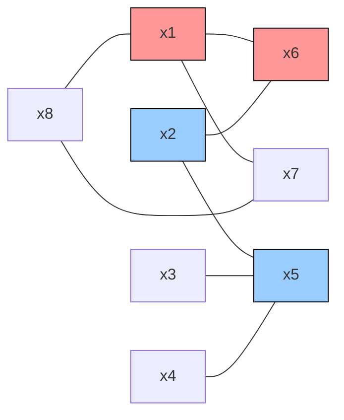
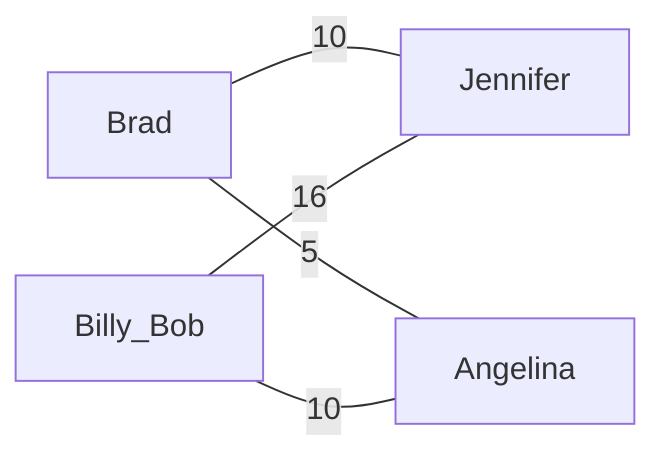

# Lecture 7: Graph Theory II – Matching Problems and Stable Marriage

## Overview
This lecture explores the application of graph theory to **matching problems**, using the vivid analogy of marriage and courtship. It introduces the formal concepts of **matchings**, **perfect matchings**, and **minimum-weight matchings**. The core of the lecture focuses on the **Stable Marriage Problem**, exploring the potential for instability ("rogue couples") when people have ranked preferences. We investigate the famous **Mating Algorithm (TMA)** (also known as the Gale-Shapley algorithm) and rigorously prove its correctness: that it terminates quickly, leaves everyone married, and guarantees absolute stability. Finally, the lecture evaluates the fairness of the algorithm, proving the surprising result that the active proposers (the boys) receive their **optimal** possible mates, while the passive receivers (the girls) are stuck with their **pessimal** (worst) possible mates.

***

## 1. Matching in Graphs
A matching problem fundamentally asks how we can pair up nodes in a graph according to their edges (compatibilities) such that no one is assigned more than one partner.

**Definitions:**
*   **Matching:** Given a graph $G = (V, E)$, a matching is a subgraph of $G$ (or equivalently, a collection of edges) where every node has a degree of exactly 1.
*   **Perfect Matching:** A matching is perfect if it covers every single node in the graph. Since every edge pairs exactly two nodes, a perfect matching must contain exactly $|V|/2$ edges. 

### Example 1: Simple Matching
Consider a graph with 8 nodes ($x_1 \dots x_8$). 

In this graph, the edge set $\{ \{x_1, x_6\}, \{x_2, x_5\} \}$ is a valid matching of size 2. We can find a larger matching of size 3: $\{ \{x_1, x_7\}, \{x_2, x_6\}, \{x_3, x_5\} \}$. 
However, **no perfect matching of size 4 exists** here. If we tried to match all 8 nodes, $x_8$ and $x_7$ would both *have* to map to $x_1$ (assuming $x_7$ is only connected to $x_1$ and $x_8$), but $x_1$ can only take one partner. 

### Min-Weight Matching
In real-world applications, some pairings are more desirable than others. We model this by assigning a numerical *weight* to each edge. Usually, a lower weight indicates a more desirable match.
**Definition:** A **min-weight matching** is a perfect matching for a graph $G$ with the minimum possible total weight across its edges.

**Example: Celebrity Matching**
Consider connecting Brad, Billy Bob, Jennifer, and Angelina.

*   If Brad pairs with Angelina (5) and Billy Bob pairs with Jennifer (16), the total weight is **21**.
*   If Brad pairs with Jennifer (10) and Billy Bob pairs with Angelina (10), the total weight is **20**.
Therefore, the min-weight matching pairs Brad with Jennifer and Billy with Angelina, even though Brad strongly preferred Angelina.

Algorithms for finding maximum matchings and min-weight perfect matchings run in polynomial time (usually $O(V^3)$), but they are complex. We will instead focus on a variation based on ranked preference lists.

## 2. The Stable Marriage Problem
Suppose instead of explicit global weights, each person simply has an ordered preference list of who they want to marry. The preferences are strictly ordered (no ties) and asymmetric (Brad might like Angelina best, but she might rank him second). 

**Definition:** Given a matching $M$, a boy $X$ and a girl $Y$ form a **rogue couple** if they are *not* married to each other in $M$, but they prefer each other over their actual mates in $M$. 
**Definition:** A matching is **stable** if there are *no* rogue couples.

If we pair Brad with Jennifer and Billy Bob with Angelina (from the example above), Brad and Angelina form a rogue couple because they both prefer each other to their current spouses. If placed on a desert island, they would cheat on their spouses, breaking the stability of the system.

### The Unisex Impossibility
Is it always possible to find a stable matching? If we allow anyone to marry anyone (unisex/same-sex allowed), the answer is **no**.

Consider a graph of 4 people: Alex, Bobby Joe, Mergatoid, and Robin. They form a "love triangle" where everyone likes the next person in the circle best.
*   Mergatoid's 1st choice is Alex.
*   Alex's 1st choice is Robin.
*   Robin's 1st choice is Bobby Joe.
*   Bobby Joe's 1st choice is Mergatoid.

**Theorem:** There does not exist a stable matching for this preference configuration.
*   *Proof by contradiction:* Assume a stable matching $M$ exists. Someone must be paired with Mergatoid. *Without loss of generality* (by symmetry), assume Mergatoid is matched to Alex. 
*   This leaves Robin matched to Bobby Joe. 
*   However, Robin prefers Alex to Bobby Joe, and Alex prefers Robin to Mergatoid. 
*   Thus, Alex and Robin form a rogue couple. $M$ is not stable. Contradiction.

## 3. The Mating Algorithm (TMA)
If we restrict the problem to bipartite graphs—where $N$ boys strictly prefer $N$ girls and vice versa—a stable perfect matching **always** exists. 

To find it, we use the **Mating Algorithm** (TMA), famously known as the Gale-Shapley algorithm. It models a courtship ritual over several "days":
1.  **Morning:** Each girl stands on her balcony. Each boy goes to the balcony of his *favorite* girl who is still on his list (i.e., has not crossed him off yet) and serenades her.
2.  **Afternoon:** Each girl looks at all the suitors currently serenading her. She tells her favorite one, "Maybe, stay around." To all the other suitors, she says, "No, take a hike."
3.  **Evening:** Any boy who was rejected crosses that girl off his list. He will go to the next girl on his list the following morning.
4.  **Termination:** The algorithm finishes on the first day where every girl has at most one suitor. They all say "Yes" and get married.

*(Note: If a boy crosses all girls off his list, he stays home and does his MIT 6.042 homework. We will prove this never happens.)*

## 4. Proving TMA's Correctness
To trust TMA for real-world tasks, we must rigorously prove four things: that it terminates, that everyone gets married, that the marriages are stable, and we must evaluate its fairness.

### Theorem 1: TMA Terminates Quickly
**Theorem:** TMA terminates in at most $N^2 + 1$ days.
*   *Proof by contradiction:* Assume TMA does not terminate in $N^2 + 1$ days.
*   Every day that the algorithm does not terminate, at least one boy must be rejected (since there are multiple boys at one balcony). That boy crosses a girl off his list.
*   There are $N$ boys, each with $N$ girls on their list, yielding exactly $N^2$ possible cross-offs.
*   By day $N^2 + 1$, there must have been $N^2 + 1$ cross-offs. This exceeds the maximum possible number of cross-offs, which is a contradiction. Thus, it must terminate.

### Lemma 1: The "Girls Only Upgrade" Invariant
**Invariant $P$:** If a girl $G$ ever rejected a boy $B$, then $G$ has a current suitor (or husband) whom she prefers to $B$.
*   *Proof by Induction on the number of days $d$:*
*   **Base Case ($d=0$):** No one has been rejected yet, so it is vacuously true.
*   **Inductive Step:** Assume $P$ holds on day $d$. On day $d+1$, either $G$ rejects $B$ today, or she rejected $B$ in the past. 
    *   If she rejects $B$ today, it is strictly because she has a better suitor right now. 
    *   If she rejected $B$ in the past, by our assumption she had a better suitor yesterday. Today, she will either keep that same suitor, or she will upgrade to an even better one. 
    *   In all cases, she maintains a suitor better than $B$. The invariant is preserved.

### Theorem 2: Everyone Gets Married
**Theorem:** Everyone is married at the end of TMA.
*   *Proof by contradiction:* Assume the algorithm terminates and some boy $B$ is not married.
*   Since there are an equal number of boys and girls, if $B$ is unmarried, some girl $G$ must also be unmarried.
*   If $B$ is unmarried, his list must be empty (he was rejected by every single girl).
*   By Lemma 1, if every girl rejected $B$, every girl must have a suitor better than $B$. 
*   If every girl has a suitor, then every girl is married. This contradicts the fact that girl $G$ is unmarried. Thus, everyone must be married.

### Theorem 3: The Matching is Stable
**Theorem:** TMA produces a stable matching (no rogue couples).
*   *Proof by contradiction:* Assume there is a rogue couple, Bob and Gail. This means Bob and Gail are not married to each other, but prefer each other over their TMA spouses. There are two cases:
    1.  **Gail rejected Bob:** If Gail rejected Bob during TMA, then by Lemma 1 she ended up marrying someone she likes *better* than Bob. Therefore, she does not prefer Bob to her spouse, and they cannot be a rogue couple.
    2.  **Gail never rejected Bob:** If Bob was never rejected by Gail, he never crossed her off his list. Because he married someone else, he must have stopped serenading before reaching Gail on his list. This means Bob prefers his current wife to Gail. Thus, they cannot be a rogue couple.
*   Both cases fail, proving no rogue couples can exist.

## 5. Fairness: Who has the advantage?
At first glance, TMA seems to favor the girls, as they get to sit on their balconies and simply keep the best option while the boys do all the work and face rejection. Mathematics proves the exact opposite. 

**Definitions:**
*   **Realm of Possibility:** A person $Y$ is in person $X$'s realm of possibility if there is *at least one* valid stable matching where $X$ and $Y$ are married.
*   **Optimal Mate:** A person's absolute favorite mate from their *realm of possibility*. (Not necessarily their #1 overall choice, but the best one they could possibly marry without breaking stability).
*   **Pessimal Mate:** A person's absolute least favorite mate from their *realm of possibility*.

### Theorems 4 & 5: Boy-Optimal and Girl-Pessimal
**Theorem 4:** TMA marries every boy to his **optimal** mate.
**Theorem 5:** TMA marries every girl to her **pessimal** mate.

*Proof of Theorem 5 (Assuming Theorem 4 is true):*
*   *Proof by contradiction:* Suppose there exists some valid stable matching $M$ where some girl $G$ fares worse than she did in TMA. 
*   Let $B$ be $G$'s husband in TMA. Let $B'$ be $G$'s husband in $M$. Since she did worse in $M$, $G$ prefers $B$ over $B'$.
*   Let $G'$ be $B$'s wife in $M$. 
*   Since $M$ is a valid stable matching, $G'$ is in $B$'s realm of possibility. 
*   By Theorem 4, TMA gives $B$ his optimal mate. So $B$ prefers $G$ (his TMA wife) over $G'$ (his $M$ wife).
*   Look at the situation in $M$: $B$ is married to $G'$, and $G$ is married to $B'$. However, $B$ prefers $G$, and $G$ prefers $B$. 
*   $B$ and $G$ form a rogue couple in $M$! This contradicts the premise that $M$ is a stable matching. Thus, no stable matching exists where $G$ does worse than TMA, meaning her TMA assignment is her absolute pessimal mate.

## 6. Applications
TMA is not just a theoretical exercise; it is heavily used in practice:
*   **Medical Residencies (NRMP):** Assigning graduating pre-med students (boys) to hospitals (girls) for internships. (Hospitals want stability so doctors don't quit for a different hospital that also wanted them).
*   **Akamai Web Routing:** Load balancing traffic on the web. Web servers act as boys, requests for service act as girls. The algorithm balances performance (latency) against cost (bandwidth) in a distributed, lightning-fast manner.

***

## Practice Problems

**Problem 7.1: Towers of Sheboygan (Recursive Definition)**
*Context:* You can refer to Problem 6.16 in the text to see the Mating Ritual applied to students and companies.
Four Students want separate assignments to four VI-A Companies.
*   **Albert:** HP, Bellcore, AT&T, Draper
*   **Sarah:** AT&T, Bellcore, Draper, HP
*   **Tasha:** HP, Draper, AT&T, Bellcore
*   **Elizabeth:** Draper, AT&T, Bellcore, HP
*   **AT&T:** Elizabeth, Albert, Tasha, Sarah
*   **Bellcore:** Tasha, Sarah, Albert, Elizabeth
*   **HP:** Elizabeth, Tasha, Albert, Sarah
*   **Draper:** Sarah, Elizabeth, Tasha, Albert

(a) Use the Mating Ritual (TMA) to find two stable assignments of Students to Companies. (Hint: run it once with students proposing, and once with companies proposing).
(b) Describe a simple procedure to determine whether any given stable marriage problem has a unique solution, that is, only one possible stable matching. Briefly explain why it works. *(Reference: mcs.pdf, Problem 6.16)*

**Problem 7.2: Invariants of the Mating Ritual**
Suppose that Harry is one of the boys and Alice is one of the girls in the Mating Ritual. Which of the properties below are preserved invariants? Why?
(a) Alice is the only girl on Harry's list.
(b) There is a girl who does not have any boys serenading her.
(c) If Alice is not on Harry's list, then Alice has a suitor that she prefers to Harry.
(d) Alice is crossed off Harry's list, and Harry prefers Alice to anyone he is serenading.
*(Reference: mcs.pdf, Problem 6.17)*

**Problem 7.3: The "Loser" Spouse Theorem**
Suppose there are two stable sets of marriages. So each man has a first wife and a second wife, and likewise each woman has a first husband and a second husband. Someone in a given marriage is a "winner" when they prefer their current spouse to their other spouse, and a "loser" when they prefer their other spouse.
(a) Explain why a married couple cannot both be "winners" based directly on the definition of a rogue couple. 
(b) Prove that in each of the marriages, someone is a winner iff their spouse is a loser.
*(Reference: mcs.pdf, Problem 6.26)*

***

## Further Reading
For a deeper dive into the formalisms of the topics covered in this lecture, please refer to **"Mathematics for Computer Science" (mcs.pdf)**:
*   **Chapter 12, Section 12.5:** Bipartite Graphs & Matchings (Formal definitions of matchings, bottlenecks, and Hall's Matching Theorem).
*   **Chapter 6, Section 6.4:** The Stable Marriage Problem (Detailed proofs of the Mating Ritual invariants, the Optimal/Pessimal theorems, and applications).